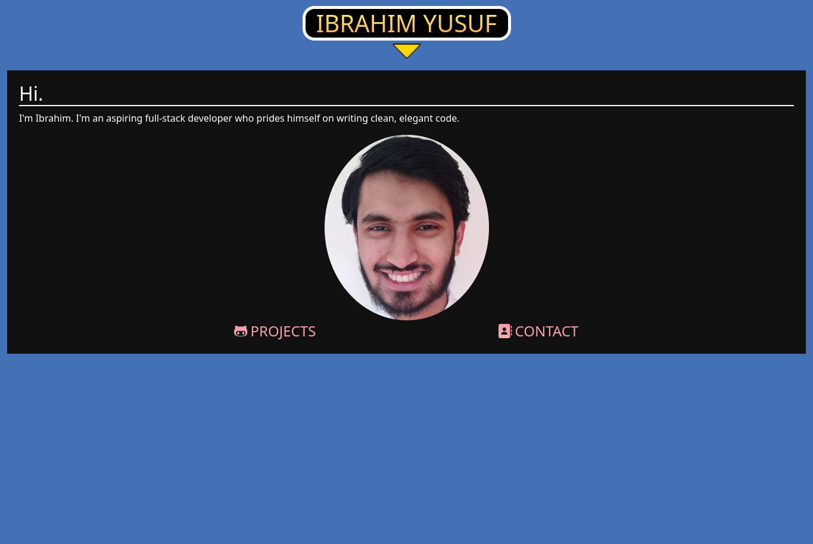

# Portfolio



This is my portfolio. It's themed around Super Mario All-Stars.

## Usage
First, clone this repository:
```bash
git clone https://github.com/iy2k22/portfolio.git
cd portfolio
```
Then, open `index.html` in a web browser.

## Credits
* [Bootstrap](https://getbootstrap.com)
* [Font Awesome](https://fontawesome.com)
* [jQuery](https://jquery.com)
* [Super Mario All-Stars Menu Sprite Sheet (which was used as a basis for this website)](https://www.spriters-resource.com/snes/smassmw/sheet/4252)